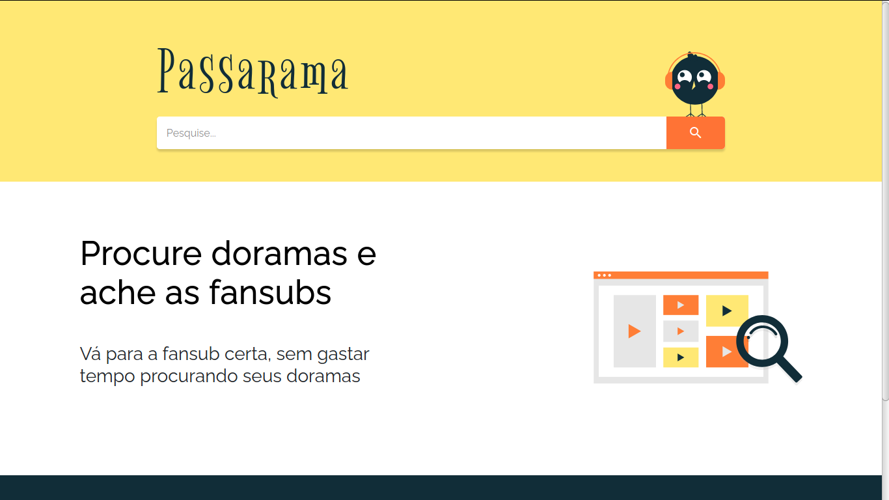
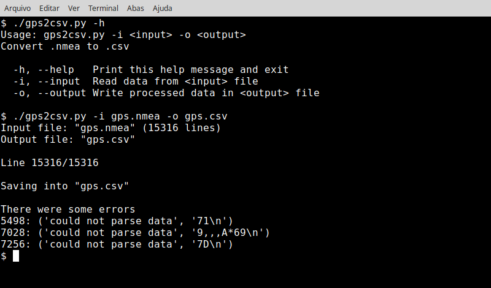
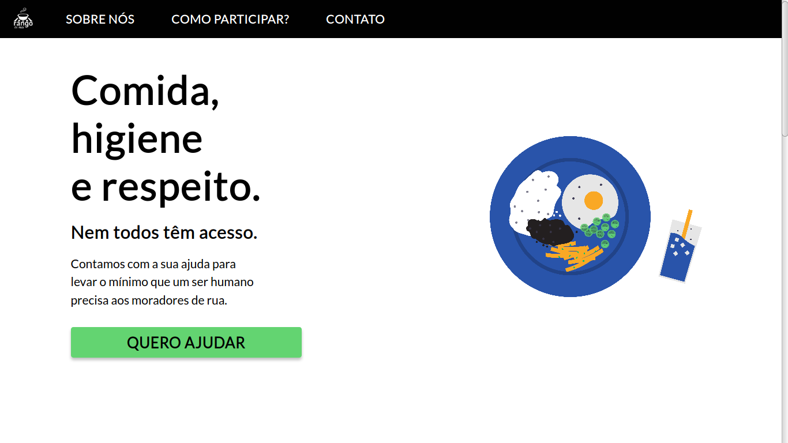
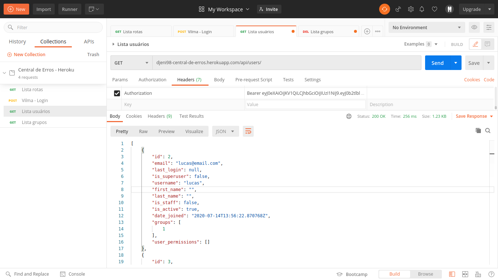
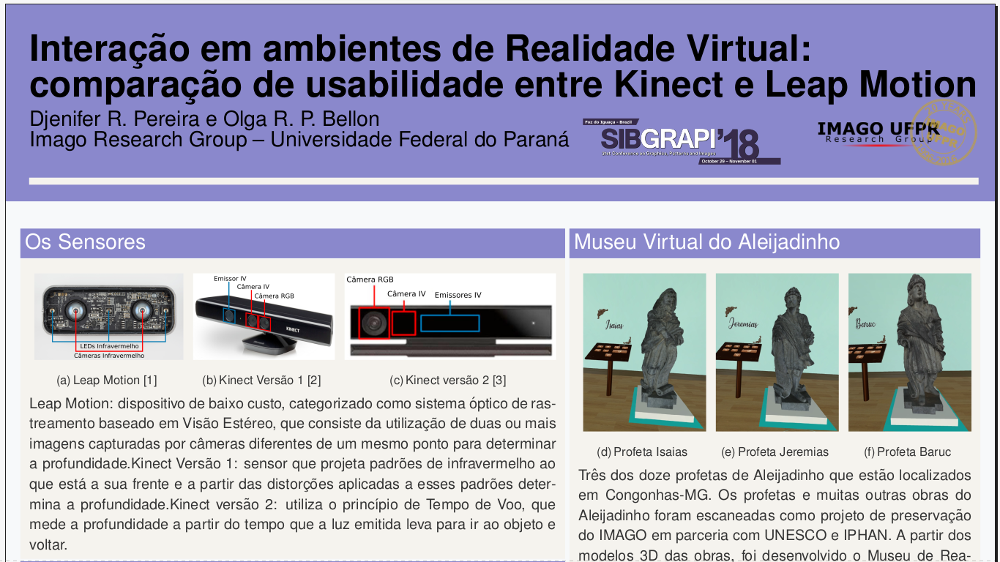
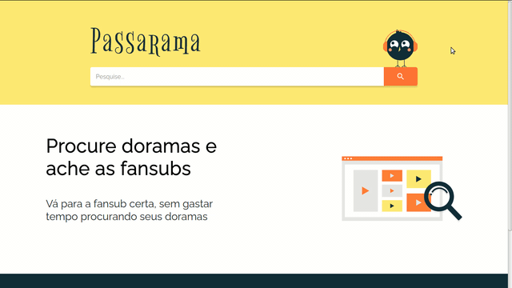
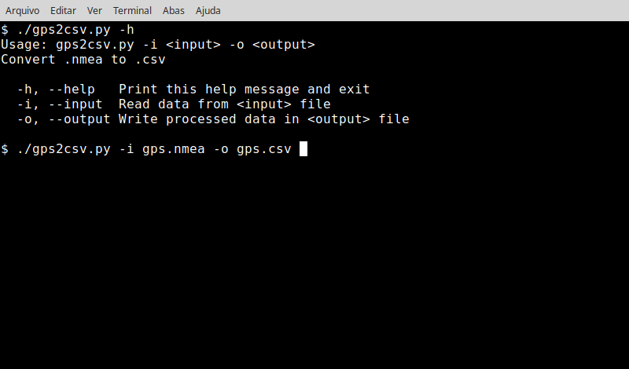
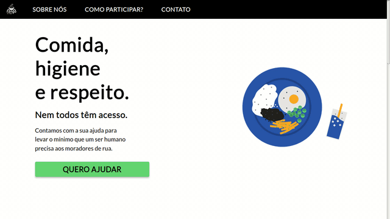
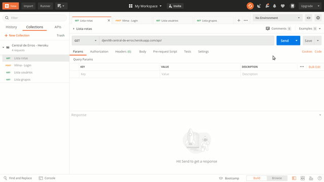
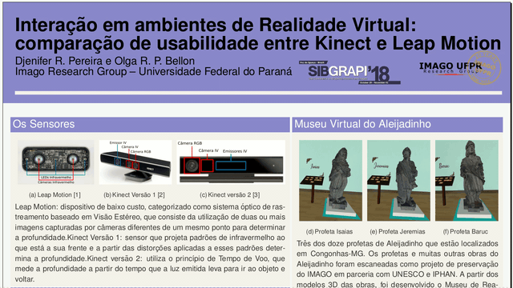

# Djenifer Renata Pereira

Os projetos que estão neste portfólio são públicos e por isso posso
compartilhá-los, meus demais projetos estão em plataformas fechadas e
necessitaria de permissão de outras pessoas para torná-los públicos.

## Passarama

Esse é um projeto que comecei para me ajudar em um dos meus hobbies: assistir
dramas asiáticos. O objetivo é facilitar o processo de achar os conteúdos nas
fansubs. O passarama contem 3 partes:
1. O crawler que inspeciona as fansubs atrás de dados sobre os dramas disponíveis
2. O back-end que guarda as informações do crawler e as disponibiliza por uma api
3. O front-end que consome a api e apresenta as informações através de um site

**Informações**
- Front-end:  https://homologacao-passarama.netlify.app/
- API: https://djeni.pythonanywhere.com/routes
- Repositório: https://github.com/djeni98/passarama

## gps2csv

Este projeto foi idealizado pelo Jackson Rossi Borguezani para ajudar no
desenvolvimento de suas atividades de iniciação científica. O objetivo é
transformar dados obtidos de um gps salvos num arquivo `.nmea` em um arquivo
`.csv`. O programa executa por linha de comando e ainda não foi lançado por
não estar finalizado.

**Informações**
- Repositório: https://github.com/djeni98/gps2csv
- Participantes: Djenifer Renata Pereira, Jackson Rossi Borguezani

## Rango de Rua
> Relacionado ao Gama Academy

Um dos desafios do Gama Experience era fazer uma transformação digital em uma ONG.
Minha equipe escolheu o Rango de Rua e parte desse projeto era criar uma landing
page para eles. Foram feitas pesquisa com a ONG, prototipação e depois o
desenvolvimento do site. 

**Informações**
- Landing Page: https://rangoderua.github.io/
- Repositório: https://github.com/rangoderua/rangoderua.github.io
- Participantes: Ana Carolina Gonçalves de Oliveira, Bernadette Saori Borges,
Djenifer Renata Pereira, Flávia Akemi Silvério Biz Deguchi,
Gustavo Rodrigues Torres, Isadora Scussel Farias, Lucimara de Souza,
Mayhara Delfim Soares, Nilo Kaway Neto, Tatyara Pires, Victor Carvalho

## Central de Erros
> Relacionado ao CodeNation

O projeto final do AceleraDev Python era implementar uma api para uma central de
erros. A partir dos wireframes disponibilizados no desafio, projetei os endpoints
para suprir a fictícia central. 

A primeira imagem apresenta o consumo da API usando o Postman e a segunda apresenta
a documentação da API.

**Informações**
- Aplicação: https://djeni98-central-de-erros.herokuapp.com/api/
- Documentação da api: https://djeni98-central-de-erros.herokuapp.com/api/docs/
- Repositório: https://github.com/djeni98/central-erros-back

## Atividades da IC
> Relacionado a Universidade |
> Iniciação Científica - Desenvolvimento de Aplicações em Museu 3D
> (Realidade Virtual)

Eu participei de uma Iniciação Científica, no qual fiz pesquisas e pude produzir
um artigo. As atividades que gosto de destacar são o levantamento de Museus
Virtuais e a publicação do artigo "Interação em ambientes de Realidade Virtual:
comparação de usabilidade entre Kinect e Leap Motion" no SIBGRAPI.

**Informações**
- Levantamento de Museus: https://drive.google.com/file/d/1tbdcBYOivIqHi_PfmTmF8oVvCh6xLz7d/view?usp=sharing
- Artigo: http://sibgrapi.sid.inpe.br/archive.cgi/sid.inpe.br/sibgrapi/2018/10.20.18.36 (download de pdf)
- Poster: https://drive.google.com/file/d/1Ag6LaTAa_bnZWwMS78QDyJOqslY2Z0UR/view?usp=sharing

---

<a href="#djenifer-renata-pereira">⇧ Voltar para o Topo</a>
